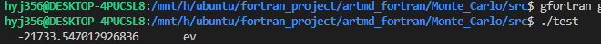
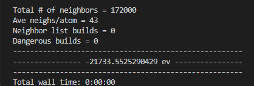
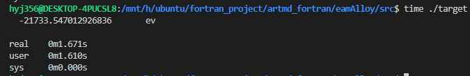
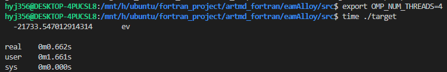
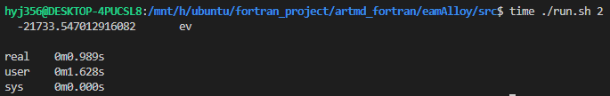

# 主程序代码示范

```fortran
program test
  use global_var, only: wp, stdout
  use fileIO, only:  Atom, ReadData, region, eamAlloyFile, &
      ReadEamAlloyFile
  use computeUE, only: Energy
  implicit none
  type(eamAlloyFile) :: CuTa             !< 含有CuTa.eam.alloy势函数信息和预处理之后的数据的派生变量
  type(Atom), allocatable :: Model(:)    !< 模型文件
  type(region) :: box                    !< 模型文件中的盒子大小
  REAL(WP) :: power

  call ReadEamAlloyFile('../potential/CuTa.eam.alloy', CuTa)    !! 读取势函数文件
  call ReadData('../model/CuTa.lmp', box, Model)                !! 读取模型文件
  call Energy(CuTa, Model, power, box)                          !! 计算模型势能
  write(stdout, *) power, ' ev'                                 !! 将模型势能输出到屏幕上面

end program test
```

​		自编程结果:



​		lammps测试in文件:

```python
# 基本设定
units metal
boundary p p p
timestep        0.001
neighbor 0.0 bin          # neigbor设为0.0, 只计算截断半径以内的原子的势能
read_data CuTa.lmp

# 定义势函数
pair_style eam/alloy
pair_coeff * * ../potential/CuTa.eam.alloy Cu Ta       
# 定义势能并输出
variable pot equal pe
thermo 100
thermo_style custom step pe ke etotal epair
run 0
print "------------------------------------------------------" 
print "---------------- ${pot} ev ----------------" 
print "------------------------------------------------------"
```

​		lammps运行结果:



​		恭喜, 大功告成, 现在你已经写好了一个可以用来读取并计算**eam/alloy**格式的势函数的程序了, 那么教程也到此为止, 下一期我将会介绍如何基于前两期的教程写一个最原始最简单的**蒙特卡洛**(**Monte Carlo**)模拟程序.


## 编译和并行运行

```makefile
FC = gfortran			# 编译器名称
TARGET = target			# 生成的可执行文件的名称
FFLAGS = -O3 -fopenmp	# 编译选项
OBJS = global_var.o mod_fileIO.o mod_computePE.o main.o		# 二进制中间文件

${TARGET}: ${OBJS}
	${FC} $^ -o $@ ${FFLAGS}	

%.o: %.f90
	${FC} -c ${FFLAGS} $< -o $@

.PHONY: clean

# clean用于清除所有中间文件和生成的可执行文件
clean:	
	rm -rf *.mod *.o ${TARGET}
```

​		如果同学们不想用并行, 那么可以将FFLAGS中的-fopenmp选项去掉, 在src中输入make, 即可获得名为target的可执行文件.

​		在每次运行之前, 通过如下命令:

```shell
export OMP_NUM_THREADS=4
```

​		可以设置openMP在并行过程中的并行核数, 好了, 现在我们已经有相应的源代码和Makefile了, 我们来对比一下并行前后的程序速度吧, Linux上面有一个time命令, 可以用来衡量一个程序的实际运行时间, 首先来看看没有开启并行的程序的运行速度:

​		

​		串行程序耗时**1.671s**, 我的电脑是4核, 这里我开启4核并行, 加入**-fopenmp**编译选项, 看看编译运行结果:



​		可以看到, 加了并行之后, 仅耗时**0.662s**就完成了任务, 加速比为**2.5**. 这时候可能会有同学问, 为什么用了4核并行加速, 速度只变快了2.5倍? 这是个好问题, 而且不止你想到, 全世界搞并行计算的科学家和工程师们, 为了在各种问题上面实现线性加速比想破了脑袋, 想秃了头, 也没办法得到一个比较好的解决办法, 而且**openMP**的并行效率是远低于**MPI**的并行效率的. 在多数情况下, 并行计算很难实现严格线性加速比, 即调用4核速度变快4倍, 调用8核速度变快8倍. 当然我说了大多数, 实际上是有反例的, 甚至一些特定问题可以实现超线性加速比, 当然那些远远超出这篇教程的内容了, 就当个题外话给大家提及一下.

​		最后的最后, 可能有同学会问, 每次运行程序之前都需要先用export设置并行核数, 是不是太麻烦了一些? 给大家提供一个小脚本**run.sh**, 只需要通过命令行传参, 就可以实现并行运行核数的快速修改.

````shell
#!/bin/bash
export OMP_NUM_THREADS=$1
./target 
````

​		这里解释一下, ./target就是我们的可执行文件的名称, 而第二行的$1是一个shell里面的预定义变量, 意思是命令行传入的第一个参数, 比如我们想要用2核并行运行, 输入如下命令:

```shell
./run.sh 2
```

​		这个2就会传递给run.sh里面的$1, \$1就会倍替换为2. 即可实现调用2核并行计算. 来看看2核的并行结果:



​		耗时**0.989s**, 比4核慢, 但是比串行快不少, 说明我们的脚本写的没问题. 


